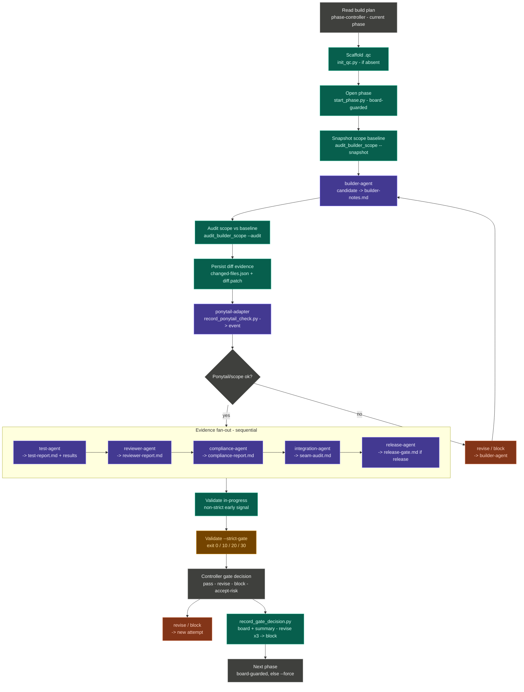
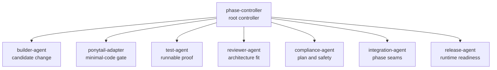

# Builder Team QC: Phase-Gated Multi-Agent Workflow For Codex

Builder Team QC helps make Codex builds easier to trust.

It is a local, phase-controlled multi-agent trial package built from a real non-coder workflow: turning scattered ideas, requirements, app notes, and rough specs into working tools. Codex can move fast, but fast builds need traceability. Without a clear process, it can be difficult to know what changed, what was installed, what was tested, and why a decision was made.

Builder Team QC solves that by breaking a build into auditable phases. Each phase uses role skills, script tools, Ponytail minimal-code checks, and .qc evidence records to track scoped changes, tests, reviews, compliance checks, seam audits, release gates, and strict validation.

The current `0.2.1-trial` line is intentionally local-first. It installs into a target project, runs as a Codex-controlled workflow rather than remote autonomous agents, and avoids public tunnels, remote services, and hidden API access by default.

Visual site: [https://randy-aloop.github.io/everythingcodex/builder-team-qc/](https://randy-aloop.github.io/everythingcodex/builder-team-qc/)

## Project Status

| Field | Value |
| --- | --- |
| Version | `0.2.1-trial` |
| Package type | Codex plugin/process |
| Runtime mode | Local-only V01 |
| Primary controller | `phase-controller` |
| Evidence store | Project-local `.qc/` folder |
| Safety posture | No secrets, no remote services, no public tunnels by default |

## Quick Install

Use the project branch directly, then install into the target project that should receive `.qc/` records and a project-local plugin copy.

```powershell
git clone --branch Codex-builder-team-multiagents --single-branch `
  https://github.com/randy-aloop/everythingcodex.git builder-team-qc

cd builder-team-qc

$PluginRoot = "$PWD\plugin"
$TargetRoot = "<target-project>"
$BuildPlan = "$TargetRoot\build-plan.md"

powershell -NoProfile -ExecutionPolicy Bypass `
  -File "$PluginRoot\scripts\install-builder-team-qc-0.2.1-trial.ps1" `
  -TargetRoot $TargetRoot `
  -FreshInstall `
  -StartPhase `
  -PhaseId phase-000 `
  -PhaseTitle 'Intake And Phase Selection' `
  -NextPhaseId phase-001 `
  -BuildPlan $BuildPlan
```

For a no-write preview, add `-DryRun`. For the full walkthrough, see [`plugin/docs/installation-and-first-run-guide.md`](plugin/docs/installation-and-first-run-guide.md).

## Attribution

Ponytail credit: the Builder Team QC `ponytail-adapter` credits [DietrichGebert/ponytail](https://github.com/DietrichGebert/ponytail), the MIT-licensed Ponytail project by Dietrich Gebert. Builder Team QC does not vendor or run upstream Ponytail by default; V01 uses a local instruction/checklist adapter unless upstream hooks are explicitly reviewed, enabled, and recorded.

## What Is A Builder-Team Multi-Agent System?

A builder-team system is a structured way for Codex to run a build like a small engineering team. The point is not to create chaos with many agents talking at once. The point is to assign stable responsibilities, write evidence to disk, and make the phase gate inspectable after the chat is over.

In `builder-team-qc`, the phase is the unit of control. Each role sees the current phase through its own lens, writes a record, and hands control back to the phase controller.

| Principle | Meaning |
| --- | --- |
| Local control | Codex stays in the loop. No hidden server, remote A2A surface, public tunnel, or automatic global install is required for V01. |
| Role clarity | Builder, reviewer, test, compliance, integration, release, and Ponytail roles each produce evidence instead of blending into one chat narrative. |
| Durable proof | The `.qc/` folder records phase runs, tests, deviations, decisions, seam audits, Ponytail checks, and gate outcomes. |

## Architecture



V01 uses logical fan-out, not true concurrent agents. Codex applies role passes sequentially unless a future runtime adds real concurrency.

## Codex Agent Types

Builder Team QC mirrors the useful mental model from Google ADK while staying local.

| Concept | Builder Team QC equivalent | Responsibility |
| --- | --- | --- |
| Reasoning agent | `builder-agent`, `reviewer-agent`, role skills | Read the phase context, reason through the current role, and write evidence. |
| Workflow agent | `phase-controller` | Controls sequence, fan-out, revise loop, and final gate decision. |
| Custom logic | Local scripts under `plugin/scripts/` | Create `.qc`, start phase records, record events, validate gates, and summarize phase state. |

## Role Model



| Role | Purpose |
| --- | --- |
| `phase-controller` | Opens phase records, routes role checks, validates evidence, and decides gates. |
| `builder-agent` | Implements only the smallest correct current-phase change. |
| `ponytail-adapter` | Applies minimal-code discipline and records the Ponytail verdict. |
| `test-agent` | Runs quick checks and records runnable proof. |
| `reviewer-agent` | Checks architecture fit, minimal code, and implementation quality. |
| `compliance-agent` | Verifies plan adherence, approvals, protected zones, and no-secrets behavior. |
| `integration-agent` | Audits previous/current/next phase seams. |
| `release-agent` | Checks production debug, runtime, Docker, rollback, and readiness evidence. |

## Orchestration Pattern

```text
plan
  -> start phase
  -> builder-agent
  -> Ponytail gate
  -> test / review / compliance / seam / release evidence
  -> strict validation
  -> pass / revise / block / accepted_with_risk
  -> phase-board final state
```

| Pattern | Builder Team QC behavior |
| --- | --- |
| Sequential | Plan, initialize `.qc`, start phase, build candidate, run Ponytail, validate. |
| Parallel-style | Test, review, compliance, seam, and release checks are independent evidence branches, but V01 runs them sequentially. |
| Loop | Revise loop is capped at three failed attempts before block or human accepted-risk decision. |

The hard stop is the deterministic validator: `validate_phase_record.py --strict-gate` must exit cleanly for evidence completion. Model-authored role reports are useful review evidence, but executable checks and validator exit codes carry more weight.

## Single-Run Vs Parallel Runtime

Builder Team QC Runtime V01 is **single-run multiagent**: one Codex runtime performs the builder-team roles one at a time. It is multiagent by role contract, not by process. Runtime V01 is not a live Google ADK runtime; it borrows ADK-style orchestration vocabulary while keeping execution local, visible, and file-auditable.

The target is still parallel-friendly:

```text
sequential build
parallel evidence checks
sequential strict gate
```

The builder and Ponytail stages should remain sequential because they create and scope the candidate change. Test, review, compliance, integration, and release checks can become parallel evidence workers later, after the strict gate, evidence schema, file locking, attempt ids, candidate/diff ids, and deterministic join rules are strong enough.

ADK alignment: `SequentialAgent` maps to ordered build control, `ParallelAgent` maps to concurrent evidence checks with explicit shared-state coordination, and `LoopAgent` maps to the bounded revise loop. For a future ADK 2.0+ implementation, graph or dynamic workflows should also be considered before committing to template workflow agents.

Detailed note: [`plugin/docs/single-run-vs-parallel-runtime.md`](plugin/docs/single-run-vs-parallel-runtime.md)

## What Is Enforced By Code?

| Gate condition | Checked by script | Judged by role review |
| --- | --- | --- |
| Ponytail event exists and latest verdict is `pass` | `validate_phase_record.py` | Reviewer may assess whether the recorded rationale is credible. |
| Test evidence exists and no recorded test failed | `validate_phase_record.py` | Test role decides whether selected checks are meaningful. |
| Required role files are present and no verdict remains pending | `validate_phase_record.py --strict-gate` | Role content quality still requires human/Codex judgment. |
| Architecture fit, maintainability, self-review quality | Not fully deterministic in V01 | Reviewer and compliance reports; executable checks should be preferred when available. |

The `0.2.1-trial` package ships the stricter helper set plus the V03.1 sync-to-code patch: non-pass role verdicts, all-skipped required tests, missing release gates, open blocker issues, and accepted-risk claims without decision-log proof must block. The package includes builder-scope audit, decision recording, gate-decision recording, Ponytail evidence binding, installed-copy validation, V03.1 doc-header checks, executed patch-record checks, and recovery-pack validation. The remaining proof gap is a real product build trial outside sandbox targets.

## Shared State: `.qc`

Builder Team QC uses project-local files as durable shared state.

| State file | Meaning |
| --- | --- |
| `.qc/phase-board.json` | Current phase id, status, next phase, release requirement, revise attempt count, latest gate, and final gate timestamp. |
| `.qc/phase-runs/<phase-id>/` | Phase record and role reports for builder, reviewer, test, compliance, seam, and release. |
| `.qc/test-results/<phase-id>.jsonl` | Machine-readable test evidence with command, status, exit code, and notes. |
| `.qc/ponytail-events.jsonl` | Ponytail mode, checks, and minimal-code verdict. |
| `.qc/deviation-log.jsonl` | Scope changes, blockers, unresolved risk, and accepted-risk metadata. |
| `.qc/decision-log.jsonl` | Human decisions, approvals, accepted-risk bypasses, and follow-up commitments. |

`accepted_with_risk` is a gate bypass, not a controller convenience. It requires an explicit human decision recorded in `decision-log.jsonl`; the controller must not self-approve incomplete evidence.

## Ponytail Gate

Ponytail is a phase-scope minimal-code discipline gate, not a test-agent helper. It checks whether the builder output obeys:

- YAGNI
- standard library first
- native platform or existing project tooling before new dependencies
- no unnecessary abstraction
- smallest correct implementation

If Ponytail passes, evidence checks fan out. If it revises or blocks, the controller should stop or loop back before spending time on deeper validation.

## Role Skill Vs Script Tool

| Feature | Role skill | Script tool |
| --- | --- | --- |
| Example | `reviewer-agent` | `record_test_result.py` |
| Who stays in control? | `phase-controller` | `phase-controller` |
| What it does | Applies a reasoning contract and writes a report. | Performs a precise record or validation action. |
| Can it advance the phase? | No. It produces evidence. | No. It records or checks evidence. |

Keeping this boundary clear prevents helper code from taking over the phase.

## Phase-By-Phase Run Plan

The detailed latest runbook is here:

[plugin/docs/phase-by-phase-run-plan.md](plugin/docs/phase-by-phase-run-plan.md)

One-page run order:

```text
0. Intake and choose one phase
1. init_qc.py
2. start_phase.py
3. builder-agent creates candidate
4. ponytail-adapter gates scope/minimal-code
5. evidence fan-out, sequential in V01
   5A. test-agent
   5B. reviewer-agent
   5C. compliance-agent
   5D. integration-agent
   5E. release-agent when release_required=true
6. validate in progress
7. validate strict gate
8. revise loop, max 3 failed attempts
9. accepted-risk path only with human decision-log proof
10. update phase-board final state
11. report gate result
12. hand off next phase
```

## Safety Defaults

Builder Team QC is local-first by default:

- no API keys
- no OAuth files
- no passwords
- no refresh tokens
- no service-account private keys
- no remote MCP/A2A/OpenAPI surfaces by default
- no remote Docker daemon by default
- no public tunnel or exposed server port by default
- no global install requirement for V01

## Build Plan Authoring

Before using Builder Team QC, write the build plan as phase contracts, not as a broad idea document. Each phase should tell the builder team what files may change, what behavior must exist, what proof must be recorded, when to stop, and what the next phase can rely on.

Use this guide when preparing a project for the builder team:

[`plugin/docs/build-plan-authoring-guide.md`](plugin/docs/build-plan-authoring-guide.md)

## Installation

Use the project branch directly. This installs from a local clone of the branch; it does not download remote scripts at runtime, store secrets, open public ports, or perform a global Codex install.

Requirements: Git, PowerShell, and Python 3. If `python` is not available on your Windows PATH, pass `-Python py` or `-Python "<python-exe>"` to the installer.

### 1. Clone The Builder Team QC Branch

```powershell
git clone --branch Codex-builder-team-multiagents --single-branch `
  https://github.com/randy-aloop/everythingcodex.git builder-team-qc

cd builder-team-qc
```

Cloning the branch gives you the Builder Team QC source folder. Codex does not automatically pick up the plugin from the clone by itself.

### 2. Run A Dry-Run Install

Set the target project where `.qc/` and the project-local plugin copy should be created:

```powershell
$PluginRoot = "$PWD\plugin"
$TargetRoot = "<target-project>"
$BuildPlan = "$TargetRoot\build-plan.md"

powershell -NoProfile -ExecutionPolicy Bypass `
  -File "$PluginRoot\scripts\install-builder-team-qc-0.2.1-trial.ps1" `
  -TargetRoot $TargetRoot `
  -FreshInstall `
  -StartPhase `
  -PhaseId phase-000 `
  -PhaseTitle 'Intake And Phase Selection' `
  -NextPhaseId phase-001 `
  -BuildPlan $BuildPlan `
  -DryRun
```

### 3. Install Into The Target Project

Run the same command without `-DryRun`:

```powershell
powershell -NoProfile -ExecutionPolicy Bypass `
  -File "$PluginRoot\scripts\install-builder-team-qc-0.2.1-trial.ps1" `
  -TargetRoot $TargetRoot `
  -FreshInstall `
  -StartPhase `
  -PhaseId phase-000 `
  -PhaseTitle 'Intake And Phase Selection' `
  -NextPhaseId phase-001 `
  -BuildPlan $BuildPlan
```

The installer creates or updates:

| Target path | Purpose |
| --- | --- |
| `$TargetRoot\.codex\plugins\builder-team-qc\` | Project-local plugin copy. |
| `$TargetRoot\.qc\` | Evidence records, phase board, logs, and templates. |
| `$TargetRoot\.qc\phase-runs\phase-000\` | First phase record when `-StartPhase` is used. |

This is still a project-local plugin/process package. It is not a guaranteed global Codex auto-load. A future global plugin install or registry-loading step can make that smoother, but V01 keeps the install local and explicit.

### 4. Tell Codex To Use It

After install, start Codex in the target project and ask for the workflow explicitly:

```text
Use builder-team-qc for this build.
Target root: <target-project>
Build plan: <build-plan-path>
Run the phase-controller workflow.
```

Useful options:

| Option | Use |
| --- | --- |
| `-DryRun` | Show planned actions without writing files. |
| `-Python py` | Use the Windows Python launcher instead of `python`. |
| `-SkipProjectPluginCopy` | Initialize `.qc/` without copying the plugin package. |
| `-SkipQcInit` | Copy the plugin package without initializing `.qc/`. |
| `-ForceTemplates` | Overwrite existing copied template files. |
| `-PhaseId`, `-PhaseTitle`, `-NextPhaseId` | Start a specific phase record. |

### Manual Fallback

If PowerShell script execution is restricted, use the Python helpers directly from the clone:

```powershell
python plugin\scripts\init_qc.py --root $TargetRoot

python plugin\scripts\start_phase.py `
  --root $TargetRoot `
  --phase-id phase-000 `
  --title "Intake And Phase Selection" `
  --next-phase-id phase-001 `
  --build-plan $BuildPlan

python plugin\scripts\validate_phase_record.py `
  --root $TargetRoot `
  --phase-id phase-000 `
  --template-only
```

## Quick Start

Use this prompt from Codex in a target project:

```text
Use builder-team-qc for this build.
Target root: <project path>
Build plan: <plan path>
Current phase: <phase id and title>
Run the latest phase-by-phase controller plan:
- initialize or verify .qc
- start/resume the phase
- run builder-agent
- run Ponytail before test/review fan-out
- run tests, reviewer, compliance, seam audit, and release gate when required
- run strict validation, using release auto-detection or --release-phase as an explicit override
- cap revise loop at three failed attempts
- require decision-log proof for accepted_with_risk
- update phase-board final gate state before allowing the next phase
```

Command-level scripts:

| Script | Purpose |
| --- | --- |
| `install-builder-team-qc-0.2.1-trial.ps1` | Current trial wrapper for prototype/trial upgrades and explicit fresh installs; preserves existing `.qc` records by default and validates the V03.1 patch evidence. |
| `install-builder-team-qc-0.2.0-trial.ps1` | Older trial wrapper retained for intentional installs of the previous package version. |
| `install-builder-team-qc.ps1` | Canonical PowerShell installer for project-local plugin copy, expected-version checks, `.qc` initialization, installed-copy validation, and optional first phase start. |
| `init_qc.py` | Create project-local `.qc` structure. |
| `start_phase.py` | Open or resume a phase run. |
| `record_ponytail_check.py` | Record minimal-code gate evidence. |
| `record_test_result.py` | Record machine-readable test evidence. |
| `record_deviation.py` | Record build-plan or safety deviations. |
| `validate_phase_record.py` | Validate phase evidence and strict gate state. |
| `summarize_phase.py` | Summarize current phase records. |

## Dry Run And Test Report

Latest detailed report: [`plugin/docs/agent-dry-run-and-test-report.md`](plugin/docs/agent-dry-run-and-test-report.md)

| Area | Result |
| --- | --- |
| Multiagent phase loop | Pass |
| Builder-agent dry run | Pass |
| Builder-agent stress test | Pass |
| Builder scope audit gate | Pass |
| Ponytail gate enforcement | Pass |
| Stop/debug/log/correct workflow | Pass as Codex-controller workflow |
| Script-level interactive ask | Not implemented in scripts |

Dry-run proof summary:

| Proof Run | Evidence Result |
| --- | --- |
| Full multiagent phase loop | 13 phases executed, 13 final strict safety gates passed, 0 unexpected unresolved failures. |
| Builder-agent current stress test | 5 builder phases executed, 5 final strict gates passed, 4 expected stop/failure checkpoints corrected. |
| Builder scope audit gate | Unexpected file creation was caught, corrected, and strict-gate enforcement passed. |
| Ponytail gate proof | `revise` verdict failed strict validation; later `pass` verdict allowed the gate to pass. |

What the tests prove:

- Required role evidence is enforced before phase completion.
- The latest Ponytail event must be `pass`.
- Required test evidence cannot be skipped.
- Builder scope audit can block unexpected files, dependency creep, and doc-only drift.
- Safety blockers stop the gate while non-blocking policy/reference findings can remain warnings.
- Corrected phases can rerun and pass, with deviations and stop reports recorded.

Current V01 boundaries:

- Role passes are sequential under Codex control, not true concurrent remote agents.
- Script-level interactive prompts are not implemented.
- `record_decision.py` and `record_gate_decision.py` are implemented. Builder changed-files/diff evidence is still written by the controller and does not yet have a dedicated recorder helper.

## Project Files

| Path | Purpose |
| --- | --- |
| [`plugin/`](plugin/) | Codex plugin package with skills, scripts, docs, and templates. |
| [`plugin/docs/agent-dry-run-and-test-report.md`](plugin/docs/agent-dry-run-and-test-report.md) | Agent dry-run, stress-test, Ponytail gate, and self-correction results. |
| [`plugin/docs/build-plan-authoring-guide.md`](plugin/docs/build-plan-authoring-guide.md) | Short authoring standard for writing phase contracts that Builder Team QC can enforce. |
| [`plugin/docs/phase-by-phase-run-plan.md`](plugin/docs/phase-by-phase-run-plan.md) | Detailed latest phase-by-phase runbook. |
| [`plugin/docs/orchestration-notes.md`](plugin/docs/orchestration-notes.md) | Operational sequence and safety defaults. |
| [`plugin/docs/orchestration-diagram.md`](plugin/docs/orchestration-diagram.md) | Mermaid diagrams for system/state/pattern views. |
| [`plugin/docs/multi-agent-modes.md`](plugin/docs/multi-agent-modes.md) | ADK-style hierarchy, delegation, state, and tool mapping. |
| [`plugin/docs/single-run-vs-parallel-runtime.md`](plugin/docs/single-run-vs-parallel-runtime.md) | Runtime V01 single-run model, V02 parallel controls, and ADK comparison. |
| [`plugin/docs/qc-record-schema.md`](plugin/docs/qc-record-schema.md) | `.qc` record contract. |
| [`site/index.html`](site/index.html) | Optional standalone static HTML page. |
| [`MASTER.md`](MASTER.md) | Canonical project map. |
| [`project.json`](project.json) | Metadata and artifact map. |
| [`STRUCTURE.md`](STRUCTURE.md) | Folder contract. |
| [`CHANGELOG.md`](CHANGELOG.md) | Change history. |

## Current Implementation Note

The latest package implements the decision and final gate helper scripts. `record_decision.py` records decision-log and accepted-risk evidence, and `record_gate_decision.py` records final phase-board transitions. The current installer validates those helper paths and the V03.1 patch evidence before accepting the package.

## Version

Current project version: `0.2.1-trial`
