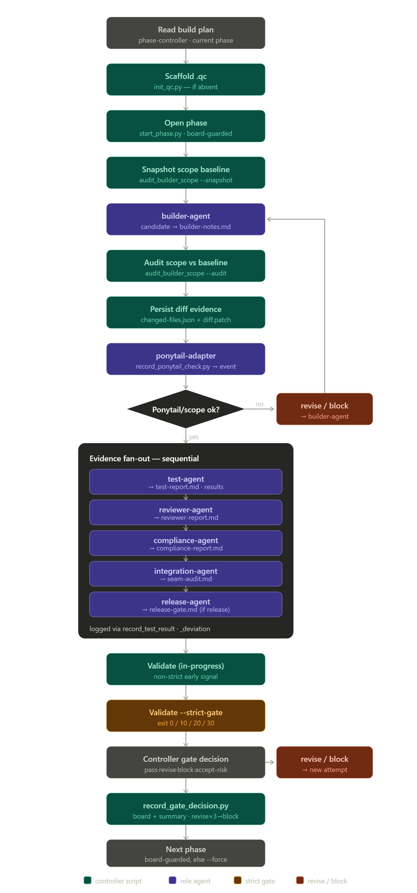
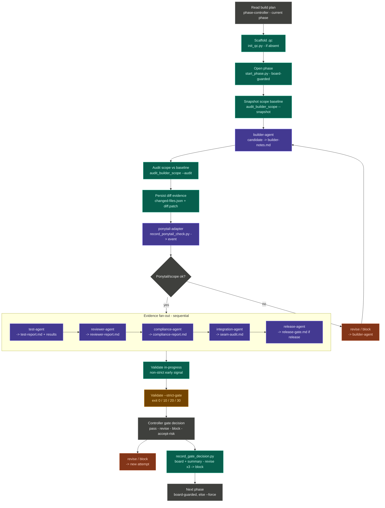
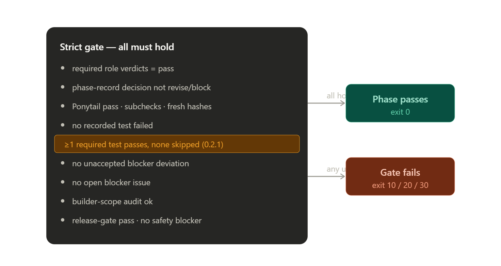

# Builder Team QC: Phase-Gated Multi-Agent Workflow For Codex


Builder Team QC helps make Codex builds easier to trust.

It is a local, phase-controlled multi-agent trial package built from a real non-coder workflow: turning scattered ideas, requirements, app notes, and rough specs into working tools. Codex can move fast, but fast builds need traceability. Without a clear process, it can be difficult to know what changed, what was installed, what was tested, and why a decision was made.

Builder Team QC solves that by breaking a build into auditable phases. Each phase uses role skills, script tools, Ponytail minimal-code checks, and .qc evidence records to track scoped changes, tests, reviews, compliance checks, seam audits, release gates, and strict validation.

The current `0.2.1-trial` line is intentionally local-first. It installs into a target project, runs as a Codex-controlled workflow rather than remote autonomous agents, and avoids public tunnels, remote services, and hidden API access by default.

## Prepare A Build Plan

Before installing Builder Team QC, do one simple thing: write the build plan by phase.

The build plan is the source of truth Codex will follow. It does not need to be complicated or overly technical. Just split the work into clear phases so Codex knows what to build first, what to check, and when the project is ready to move to the next step.

This is what makes Builder Team QC useful: instead of asking Codex to work from one big loose idea, you give it a simple phase-by-phase path that can be tracked, reviewed, and validated.

Use this guide when preparing your build plan:

[plugin/docs/build-plan-authoring-guide.md](https://github.com/randy-aloop/everythingcodex/blob/Codex-builder-team-multiagents/plugin/docs/build-plan-authoring-guide.md)

Visual site: [https://randy-aloop.github.io/everythingcodex/builder-team-qc/](https://randy-aloop.github.io/everythingcodex/builder-team-qc/)

## Project Status

| Field | Value |
| --- | --- |
| Version | `0.2.1-trial` |
| Package type | Codex plugin/process |
| Runtime mode | Local-only Runtime V01 |
| Primary controller | `phase-controller` |
| Evidence store | Project-local `.qc/` folder |
| Safety posture | No secrets, no remote services, no public tunnels by default |

Runtime V01 means local sequential execution by one Codex-controlled workflow; the package version is `0.2.1-trial`.

Current limits: role passes are sequential, script-level interactive prompts are not implemented, and builder changed-files/diff evidence is still written by the controller rather than a dedicated recorder helper.

Implementation note: the current package includes `record_decision.py`, `record_gate_decision.py`, installed-copy validation, and V03.1 patch-evidence checks before accepting the package.

## Installation

Follow these steps to install Builder Team QC into a target project, create local `.qc` evidence, inspect the initialized state, and start the first phase from Codex. The dry run is no-write by design; inspect `.qc` after the real install step.

```powershell
# 1. Clone the source branch.
git clone --branch Codex-builder-team-multiagents --single-branch `
  https://github.com/randy-aloop/everythingcodex.git builder-team-qc

cd builder-team-qc

# 2. Point at a target project and an existing build plan.
$PluginRoot = "$PWD\plugin"
$TargetRoot = "<target-project>"
$BuildPlan = "$TargetRoot\build-plan.md"
$Python = "python"

# Create build-plan.md first. See plugin/docs/build-plan-authoring-guide.md.
# If python is not on PATH, set $Python to "py" or a full python.exe path.

# 3. Preview the install without writing files.
powershell -NoProfile -ExecutionPolicy Bypass `
  -File "$PluginRoot\scripts\install-builder-team-qc-0.2.1-trial.ps1" `
  -TargetRoot $TargetRoot `
  -Python $Python `
  -FreshInstall `
  -StartPhase `
  -PhaseId phase-000 `
  -PhaseTitle 'Intake And Phase Selection' `
  -NextPhaseId phase-001 `
  -BuildPlan $BuildPlan `
  -DryRun

# 4. Install, then inspect .qc.
powershell -NoProfile -ExecutionPolicy Bypass `
  -File "$PluginRoot\scripts\install-builder-team-qc-0.2.1-trial.ps1" `
  -TargetRoot $TargetRoot `
  -Python $Python `
  -FreshInstall `
  -StartPhase `
  -PhaseId phase-000 `
  -PhaseTitle 'Intake And Phase Selection' `
  -NextPhaseId phase-001 `
  -BuildPlan $BuildPlan `
  -WriteInstallReport

Get-ChildItem -Force "$TargetRoot\.qc"
Get-Content "$TargetRoot\.qc\phase-board.json"
```

Then start Codex in the target project and prompt:

```text
Use builder-team-qc for this build.
Target root: <target-project>
Build plan: <target-project>\build-plan.md
Current phase: phase-000 Intake And Phase Selection
Run the phase-controller workflow.
```

Full walkthrough: [`plugin/docs/installation-and-first-run-guide.md`](plugin/docs/installation-and-first-run-guide.md).

## What Is A Builder-Team Multi-Agent System?

A builder-team system is a structured way for Codex to run a build like a small engineering team. The point is not to create chaos with many agents talking at once. The point is to assign stable responsibilities, write evidence to disk, and make the phase gate inspectable after the chat is over.

In `builder-team-qc`, the phase is the unit of control. Each role sees the current phase through its own lens, writes a record, and hands control back to the phase controller.

| Principle | Meaning |
| --- | --- |
| Local control | Codex stays in the loop. No hidden server, remote A2A surface, public tunnel, or automatic global install is required for Runtime V01. |
| Role clarity | Builder, reviewer, test, compliance, integration, release, and Ponytail roles each produce evidence instead of blending into one chat narrative. |
| Durable proof | The `.qc/` folder records phase runs, tests, deviations, decisions, seam audits, Ponytail checks, and gate outcomes. |

## Architecture



<details>
<summary>Editable Mermaid source</summary>



</details>

Runtime V01 uses logical fan-out, not true concurrent agents. Codex applies role passes sequentially unless a future runtime adds real concurrency.

### Orchestration Pattern

At a high level, the architecture is a controlled handoff: the controller opens the phase, role agents produce evidence, script tools record or validate that evidence, and the controller makes the gate decision.

```text
plan
  -> start phase
  -> builder-agent
  -> Ponytail gate
  -> test / review / compliance / seam / release evidence
  -> strict validation
  -> pass / revise / block / accepted_with_risk
  -> phase-board final state
```

| Pattern | Builder Team QC behavior |
| --- | --- |
| Sequential | Plan, initialize `.qc`, start phase, build candidate, run Ponytail, validate. |
| Loop | Revise loop is capped at three failed attempts before block or human accepted-risk decision. |

The hard stop is the deterministic validator: `validate_phase_record.py --strict-gate` must exit cleanly for evidence completion. Model-authored role reports are useful review evidence, but executable checks and validator exit codes carry more weight.

### Codex Agent Types

Builder Team QC mirrors the useful mental model from Google ADK while staying local.

| Concept | Builder Team QC equivalent | Responsibility |
| --- | --- | --- |
| Reasoning agent | `builder-agent`, `reviewer-agent`, role skills | Read the phase context, reason through the current role, and write evidence. |
| Workflow agent | `phase-controller` | Controls sequence, fan-out, revise loop, and final gate decision. |
| Custom logic | Local scripts under `plugin/scripts/` | Create `.qc`, start phase records, record events, validate gates, and summarize phase state. |

### Role Skill Vs Script Tool

| Feature | Role skill | Script tool |
| --- | --- | --- |
| Example | `reviewer-agent` | `record_test_result.py` |
| Who stays in control? | `phase-controller` | `phase-controller` |
| What it does | Applies a reasoning contract and writes a report. | Performs a precise record or validation action. |
| Can it advance the phase? | No. It produces evidence. | No. It records or checks evidence. |

Keeping this boundary clear prevents helper code from taking over the phase.

### Role Architecture And Shared State

The role architecture explains who owns each part of a phase. The controller is the only decider: role output is evidence, not authority. A role can recommend pass, revise, block, or risk acceptance, but `phase-controller` reads the evidence, runs the validator, records the gate decision, and decides whether the phase may move forward.



| Role | Responsibility | Primary evidence |
| --- | --- | --- |
| `phase-controller` | Opens or resumes the phase, routes role work, runs validation, and records the final gate. | `.qc/phase-board.json`, `phase-record.md`, `gate-summary.md`, `gate-events.jsonl` |
| `builder-agent` | Makes the smallest correct candidate change for the current phase. | `builder-notes.md`, `changed-files.json`, `implementation-diff.patch` |
| `ponytail-adapter` | Applies minimal-code discipline before deeper review effort begins. | `ponytail-events.jsonl` plus binding hashes |
| `test-agent` | Runs or records runnable proof. | `test-report.md`, `test-results/<phase-id>.jsonl` |
| `reviewer-agent` | Checks implementation quality, maintainability, and architectural fit. | `reviewer-report.md` |
| `compliance-agent` | Checks plan adherence, protected zones, safety defaults, and record completeness. | `compliance-report.md` |
| `integration-agent` | Checks previous/current/next phase seams. | `seam-audit.md` |
| `release-agent` | Checks runtime, Docker, rollback, logs, and release readiness when release evidence is required. | `release-gate.md` |

Every role reads from and writes back to `.qc`. This keeps the system local and sequential while still giving it a multi-agent shape: each role has a stable contract, but there is no hidden remote worker and no true parallel runtime in Runtime V01.

### Revise Loop And Attempt Counter

The revise loop explains how failure returns to the builder without letting the phase drift forever. The validator can reject a phase, but `record_gate_decision.py` turns the controller's decision into durable board state.

Each `revise` decision sets `next = attempts + 1`. Once `next >= max_revise` (default `3`), the helper auto-converts the gate to `block` and exits `10`. A `pass` or `accepted_with_risk` resets the counter to `0`.



| Gate | Terminal? | Attempt counter | Next behavior |
| --- | --- | --- | --- |
| `pass` | Yes | Reset to `0` | Next phase is allowed. |
| `accepted_with_risk` | Yes | Reset to `0` | Next phase is allowed only when a matching decision-log record exists. |
| `revise` | No | Increment by `1` | Controller loops to a new builder attempt; next phase remains blocked. |
| `block` | Yes, failed | Preserved at failure point | Controller stops; user or build owner must re-scope, accept risk, or reopen intentionally. |

The board status from the decision drives `start_phase`: `revise` is non-terminal and loops, `pass` and `accepted_with_risk` are terminal-success states, and `block` is terminal-failed. This is why role evidence does not move the phase by itself; only the controller's recorded gate decision changes phase state.

### Strict Gate Logic

The amber `validate --strict-gate` step is where the hard pass/fail logic lives. It is a single all-must-hold gate: if any required condition fails, the validator exits non-zero.



The highlighted required-test rule is the `0.2.1-trial` hardening change: at least one required test must pass, and required tests cannot be skipped.

Exit-code precedence:

| Exit | Meaning | Checked |
| --- | --- | --- |
| `20` | Schema/config/invocation error | First |
| `30` | Safety blocker from `--scan-safety` | Second |
| `10` | Strict gate condition failed | Third |

If more than one class of failure exists, the validator returns the first applicable class: schema `20`, then safety `30`, then strict gate `10`.

## What Is Enforced By Code?

| Gate condition | Checked by script | Judged by role review |
| --- | --- | --- |
| Required phase files exist | `validate_phase_record.py` | Role content quality still requires human/Codex judgment. |
| Required role verdicts are `pass` | `validate_phase_record.py --strict-gate` | Role content quality still requires human/Codex judgment. |
| Phase record decision is not `revise` or `block` | `validate_phase_record.py` | Controller decides whether the written decision matches the real state. |
| Ponytail event exists, latest verdict is `pass`, subchecks pass, and hashes are fresh | `validate_phase_record.py --strict-gate`; `record_ponytail_check.py` records evidence | Reviewer may assess whether the recorded rationale is credible. |
| Test evidence exists, no recorded test failed, at least one required test passed, and required tests were not skipped | `validate_phase_record.py --strict-gate`; `record_test_result.py --required --attempt` records evidence | Test role decides whether selected checks are meaningful. |
| Blocker deviations are accepted only with decision-log proof | `validate_phase_record.py`; `record_decision.py` records the decision | Human/user acceptance is required for real accepted risk. |
| Open blocker issues stop the gate | `validate_phase_record.py` | Controller must confirm issue status reflects reality. |
| Builder scope audit is present and passes when required | `audit_builder_scope.py`; `validate_phase_record.py --require-builder-scope` | Reviewer/compliance roles judge whether allowed changes are justified. |
| Release phases require `release-gate.md` verdict `pass` | `validate_phase_record.py --release-phase` or auto release detection | Release role checks runtime, rollback, and deployment readiness. |
| Safety scan blockers stop the gate with exit `30` | `validate_phase_record.py --scan-safety` | Compliance role reviews whether findings are real blockers. |
| Architecture fit, maintainability, self-review quality | Not fully deterministic in Runtime V01 | Reviewer and compliance reports; executable checks should be preferred when available. |

The `0.2.1-trial` package ships the stricter helper set plus the V03.1 sync-to-code patch: non-pass role verdicts, all-skipped required tests, missing release gates, open blocker issues, and accepted-risk claims without decision-log proof must block. The package includes builder-scope audit, decision recording, gate-decision recording, Ponytail evidence binding, installed-copy validation, V03.1 doc-header checks, executed patch-record checks, and recovery-pack validation. The remaining proof gap is a real product build trial outside sandbox targets.

## Shared State: `.qc`

Builder Team QC uses project-local files as durable shared state.

| State file | Meaning |
| --- | --- |
| `.qc/phase-board.json` | Current phase id, status, next phase, release requirement, revise attempt count, latest gate, and final gate timestamp. |
| `.qc/phase-runs/<phase-id>/` | Phase record and role reports for builder, reviewer, test, compliance, seam, and release. |
| `.qc/phase-runs/<phase-id>/changed-files.json` | Machine-readable changed-file evidence for the builder candidate. |
| `.qc/phase-runs/<phase-id>/implementation-diff.patch` | Diff evidence or equivalent patch summary for reviewer and compliance checks. |
| `.qc/phase-runs/<phase-id>/evidence/builder-scope-audit.json` | Builder-scope audit result comparing post-build files against the pre-builder baseline. |
| `.qc/phase-runs/<phase-id>/gate-summary.md` | Final gate result, validator outcome, phase-board transition, and closeout note. |
| `.qc/test-results/<phase-id>.jsonl` | Machine-readable test evidence with command, status, exit code, attempt, required flag, output file, and notes. |
| `.qc/ponytail-events.jsonl` | Ponytail mode, checks, minimal-code verdict, attempt, mode source, and binding hashes. |
| `.qc/deviation-log.jsonl` | Scope changes, blockers, unresolved risk, issue ids, decision ids, and accepted-risk metadata. |
| `.qc/decision-log.jsonl` | Human decisions, approvals, accepted-risk bypasses, and follow-up commitments. |
| `.qc/issue-register.jsonl` | Open, resolved, accepted, and blocker issue records used by the strict gate. |
| `.qc/gate-events.jsonl` | Final gate decisions recorded by `record_gate_decision.py`. |

`accepted_with_risk` is a gate bypass, not a controller convenience. It requires an explicit human decision recorded in `decision-log.jsonl`; the controller must not self-approve incomplete evidence.

## Single-Run Vs Parallel Runtime

Builder Team QC Runtime V01 is **single-run multiagent**: one Codex runtime performs the builder-team roles one at a time. It is multiagent by role contract, not by process. Runtime V01 is not a live Google ADK runtime; it borrows ADK-style orchestration vocabulary while keeping execution local, visible, and file-auditable.

The target is still parallel-friendly:

```text
sequential build
parallel evidence checks
sequential strict gate
```

The builder and Ponytail stages should remain sequential because they create and scope the candidate change. Test, review, compliance, integration, and release checks can become parallel evidence workers later, after the strict gate, evidence schema, file locking, attempt ids, candidate/diff ids, and deterministic join rules are strong enough.

ADK alignment: `SequentialAgent` maps to ordered build control, `ParallelAgent` maps to concurrent evidence checks with explicit shared-state coordination, and `LoopAgent` maps to the bounded revise loop. For a future ADK 2.0+ implementation, graph or dynamic workflows should also be considered before committing to template workflow agents.

Detailed note: [`plugin/docs/single-run-vs-parallel-runtime.md`](plugin/docs/single-run-vs-parallel-runtime.md)

## Safety Defaults

Builder Team QC is local-first by default:

- no API keys
- no OAuth files
- no passwords
- no refresh tokens
- no service-account private keys
- no remote MCP/A2A/OpenAPI surfaces by default
- no remote Docker daemon by default
- no public tunnel or exposed server port by default
- no global install requirement for Runtime V01

## Installer Options

The main install path is the [`Installation`](#installation) flow above. Use this section when you need installer options, manual fallback, or a reminder of what gets written.

Use the project branch directly. This installs from a local clone of the branch; it does not download remote scripts at runtime, store secrets, open public ports, or perform a global Codex install. Requirements: Git, PowerShell, and Python 3. If `python` is not available on your Windows PATH, pass `-Python py` or `-Python "<python-exe>"` to the installer.

The installer creates or updates:

| Target path | Purpose |
| --- | --- |
| `$TargetRoot\.codex\plugins\builder-team-qc\` | Project-local plugin copy. |
| `$TargetRoot\.qc\` | Evidence records, phase board, logs, and templates. |
| `$TargetRoot\.qc\phase-runs\phase-000\` | First phase record when `-StartPhase` is used. |

This is still a project-local plugin/process package. It is not a guaranteed global Codex auto-load. A future global plugin install or registry-loading step can make that smoother, but Runtime V01 keeps the install local and explicit.

Useful options:

| Option | Use |
| --- | --- |
| `-DryRun` | Show planned actions without writing files. |
| `-Python py` | Use the Windows Python launcher instead of `python`. |
| `-SkipProjectPluginCopy` | Initialize `.qc/` without copying the plugin package. |
| `-SkipQcInit` | Copy the plugin package without initializing `.qc/`. |
| `-ForceTemplates` | Overwrite existing copied template files. |
| `-WriteInstallReport` | Write installed package metadata to `.codex\plugins\builder-team-qc\install-report.json`. |
| `-PhaseId`, `-PhaseTitle`, `-NextPhaseId` | Start a specific phase record. |

### Manual Fallback

If PowerShell script execution is restricted, use the Python helpers directly from the clone after setting `$TargetRoot` and `$BuildPlan`:

```powershell
python plugin\scripts\init_qc.py --root $TargetRoot

python plugin\scripts\start_phase.py `
  --root $TargetRoot `
  --phase-id phase-000 `
  --title "Intake And Phase Selection" `
  --next-phase-id phase-001 `
  --build-plan $BuildPlan

python plugin\scripts\validate_phase_record.py `
  --root $TargetRoot `
  --phase-id phase-000 `
  --template-only
```

## Run Workflow Prompt

Use this prompt from Codex in a target project:

```text
Use builder-team-qc for this build.
Target root: <project path>
Build plan: <plan path>
Current phase: <phase id and title>
Run the latest phase-by-phase controller plan:
- initialize or verify .qc
- start/resume the phase
- run builder-agent
- run Ponytail before test/review fan-out
- run tests, reviewer, compliance, seam audit, and release gate when required
- run strict validation, using release auto-detection or --release-phase as an explicit override
- cap revise loop at three failed attempts
- require decision-log proof for accepted_with_risk
- update phase-board final gate state before allowing the next phase
```

### Command-Level Scripts

| Script | Purpose |
| --- | --- |
| `install-builder-team-qc-0.2.1-trial.ps1` | Current trial wrapper for prototype/trial upgrades and explicit fresh installs; preserves existing `.qc` records by default and validates the V03.1 patch evidence. |
| `install-builder-team-qc-0.2.0-trial.ps1` | Older trial wrapper retained for intentional installs of the previous package version. |
| `install-builder-team-qc.ps1` | Canonical PowerShell installer for project-local plugin copy, expected-version checks, `.qc` initialization, installed-copy validation, and optional first phase start. |
| `init_qc.py` | Create project-local `.qc` structure. |
| `start_phase.py` | Open or resume a phase run. |
| `audit_builder_scope.py` | Snapshot pre-builder file scope and audit post-builder changes. |
| `record_ponytail_check.py` | Record minimal-code gate evidence. |
| `record_test_result.py` | Record machine-readable test evidence. |
| `record_deviation.py` | Record build-plan or safety deviations. |
| `record_decision.py` | Record human approvals, accepted-risk decisions, rollback, owner, deadline, and follow-up commitments. |
| `record_gate_decision.py` | Record final gate transitions, update `phase-board.json`, append `gate-events.jsonl`, and write `gate-summary.md`. |
| `validate_phase_record.py` | Validate phase evidence and strict gate state. |
| `summarize_phase.py` | Summarize current phase records. |

## Dry Run And Test Report

Latest detailed report: [`plugin/docs/agent-dry-run-and-test-report.md`](plugin/docs/agent-dry-run-and-test-report.md)

| Area | Result |
| --- | --- |
| Multiagent phase loop | Pass |
| Builder-agent dry run | Pass |
| Builder-agent stress test | Pass |
| Builder scope audit gate | Pass |
| Ponytail gate enforcement | Pass |
| Stop/debug/log/correct workflow | Pass as Codex-controller workflow |
| Script-level interactive ask | Not implemented in scripts |

Dry-run proof summary:

| Proof Run | Evidence Result |
| --- | --- |
| Full multiagent phase loop | 13 phases executed, 13 final strict safety gates passed, 0 unexpected unresolved failures. |
| Builder-agent current stress test | 5 builder phases executed, 5 final strict gates passed, 4 expected stop/failure checkpoints corrected. |
| Builder scope audit gate | Unexpected file creation was caught, corrected, and strict-gate enforcement passed. |
| Ponytail gate proof | `revise` verdict failed strict validation; later `pass` verdict allowed the gate to pass. |

What the tests prove:

- Required role evidence is enforced before phase completion.
- The latest Ponytail event must be `pass`.
- Required test evidence cannot be skipped.
- Builder scope audit can block unexpected files, dependency creep, and doc-only drift.
- Safety blockers stop the gate while non-blocking policy/reference findings can remain warnings.
- Corrected phases can rerun and pass, with deviations and stop reports recorded.

Current Runtime V01 boundaries:

- Role passes are sequential under Codex control, not true concurrent remote agents.
- Script-level interactive prompts are not implemented.
- `record_decision.py` and `record_gate_decision.py` are implemented. Builder changed-files/diff evidence is still written by the controller and does not yet have a dedicated recorder helper.

## Project Files

| Path | Purpose |
| --- | --- |
| [`plugin/`](plugin/) | Codex plugin package with skills, scripts, docs, and templates. |
| [`plugin/docs/agent-dry-run-and-test-report.md`](plugin/docs/agent-dry-run-and-test-report.md) | Agent dry-run, stress-test, Ponytail gate, and self-correction results. |
| [`plugin/docs/build-plan-authoring-guide.md`](plugin/docs/build-plan-authoring-guide.md) | Short authoring standard for writing phase contracts that Builder Team QC can enforce. |
| [`plugin/docs/phase-by-phase-run-plan.md`](plugin/docs/phase-by-phase-run-plan.md) | Detailed latest phase-by-phase runbook. |
| [`plugin/docs/orchestration-notes.md`](plugin/docs/orchestration-notes.md) | Operational sequence and safety defaults. |
| [`plugin/docs/orchestration-diagram.md`](plugin/docs/orchestration-diagram.md) | Mermaid diagrams for system/state/pattern views. |
| [`plugin/docs/multi-agent-modes.md`](plugin/docs/multi-agent-modes.md) | ADK-style hierarchy, delegation, state, and tool mapping. |
| [`plugin/docs/single-run-vs-parallel-runtime.md`](plugin/docs/single-run-vs-parallel-runtime.md) | Runtime V01 single-run model, V02 parallel controls, and ADK comparison. |
| [`plugin/docs/qc-record-schema.md`](plugin/docs/qc-record-schema.md) | `.qc` record contract. |
| [`site/index.html`](site/index.html) | Optional standalone static HTML page. |
| [`MASTER.md`](MASTER.md) | Canonical project map. |
| [`project.json`](project.json) | Metadata and artifact map. |
| [`STRUCTURE.md`](STRUCTURE.md) | Folder contract. |
| [`CHANGELOG.md`](CHANGELOG.md) | Change history. |

## Credits

Ponytail credit: the Builder Team QC `ponytail-adapter` credits [DietrichGebert/ponytail](https://github.com/DietrichGebert/ponytail), the MIT-licensed Ponytail project by Dietrich Gebert. Builder Team QC does not vendor or run upstream Ponytail by default; Runtime V01 uses a local instruction/checklist adapter unless upstream hooks are explicitly reviewed, enabled, and recorded.

## Version

Current project version: `0.2.1-trial`
