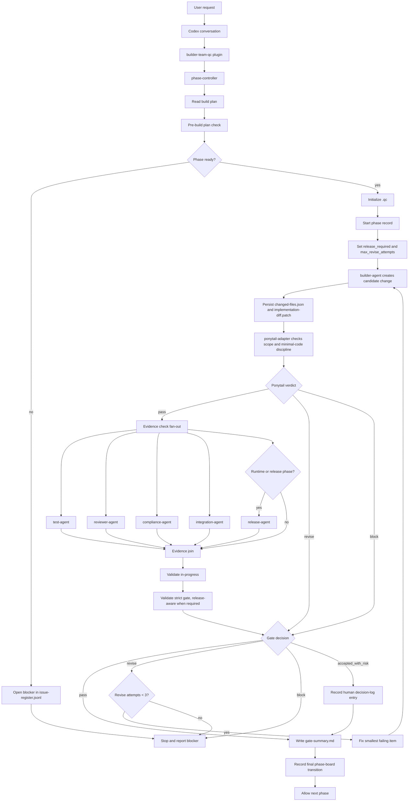
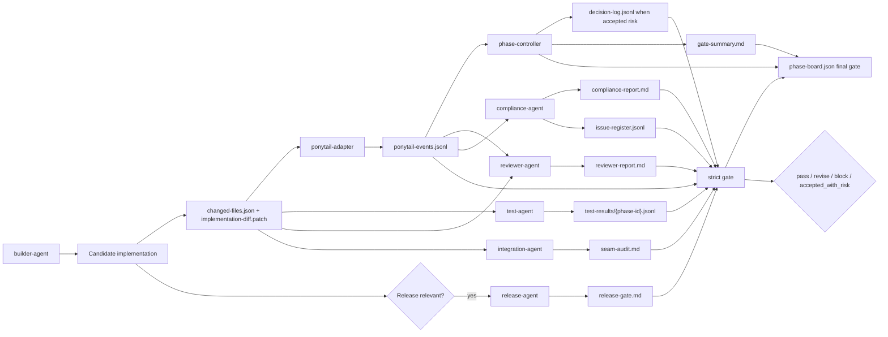
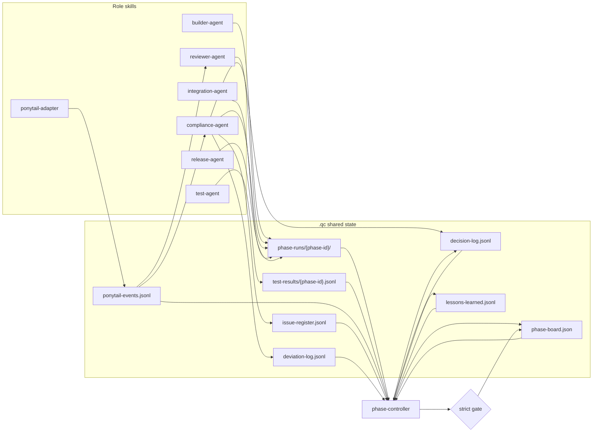
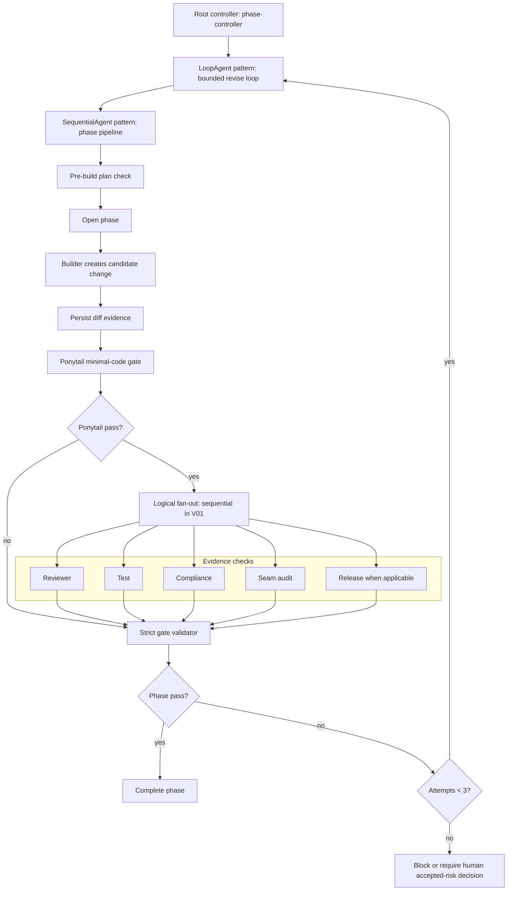

# Orchestration Diagram

Version: V02
Updated: 2026-06-23
Supersedes: V01

This diagram shows how `builder-team-qc` runs a phase-controlled multiagent Ponytail build in V01.

The important correction: `ponytail-adapter` is not owned by `test-agent`. Ponytail checks the builder output and contributes gate evidence for the controller, reviewer, and compliance roles. Tests run after Ponytail passes because testing an over-scoped or over-abstracted change is usually wasted work.

V01 uses logical fan-out, not true concurrent agents. Codex executes each role pass sequentially unless a future runtime adds real concurrency.

## System View

## Evidence Responsibility View

Strict gate requires `pass` verdicts for required role reports. `revise`, `block`, missing or conflicting verdicts, open blocker issues, only skipped required tests, or release phases with `release-gate.md` still `not_applicable` must not pass without a matching human accepted-risk record. When release is not required, `not_applicable` still needs a written rationale.

## Shared State View

## ADK-Style Pattern View

