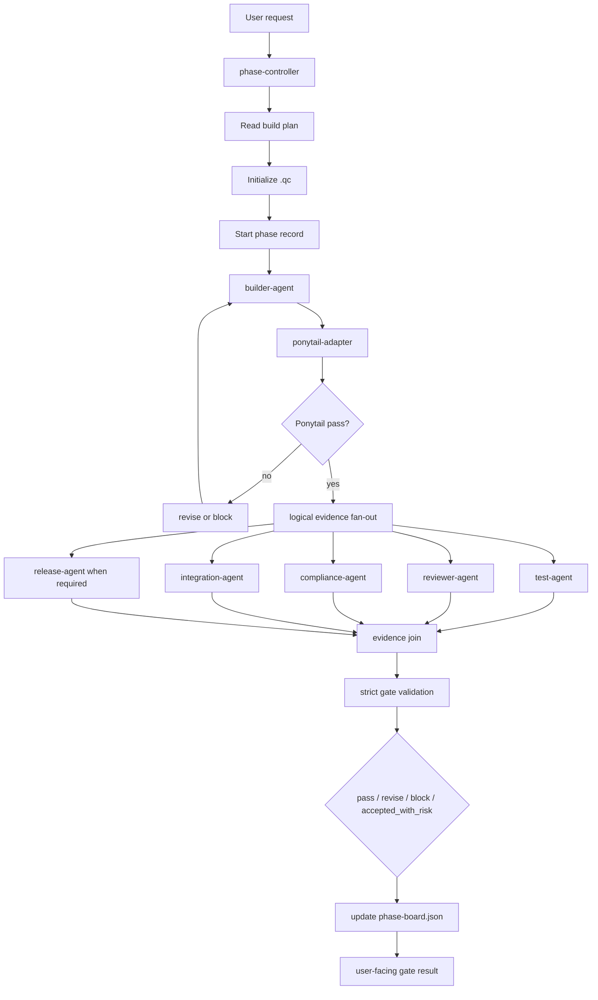
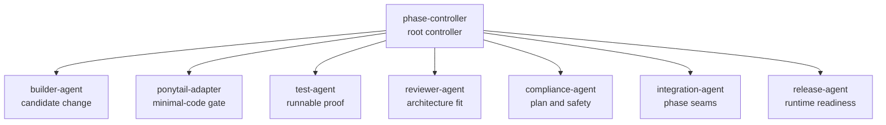

# Builder Team QC

**Building Collaborative Codex: a local builder-team multi-agent system with phase gates, role contracts, Ponytail minimal-code discipline, and durable `.qc` evidence.**

Builder Team QC is a local Codex plugin/process for phase-controlled multi-agent software builds. It turns a normal Codex build into an evidence-first builder-team workflow with stable role contracts, `.qc` phase records, Ponytail minimal-code checks, seam audits, test evidence, compliance review, and strict gate validation.

This README is the GitHub-rendered presentation for the project. The HTML page under [`site/index.html`](site/index.html) is kept as an optional standalone browser artifact, but GitHub shows HTML as source code in the repository view.

## Project Status

| Field | Value |
| --- | --- |
| Version | `0.1.0-planning` |
| Package type | Codex plugin/process |
| Runtime mode | Local-only V01 |
| Primary controller | `phase-controller` |
| Evidence store | Project-local `.qc/` folder |
| Safety posture | No secrets, no remote services, no public tunnels by default |

## Attribution

Ponytail credit: the Builder Team QC `ponytail-adapter` credits [DietrichGebert/ponytail](https://github.com/DietrichGebert/ponytail), the MIT-licensed Ponytail project by Dietrich Gebert. Builder Team QC does not vendor or run upstream Ponytail by default; V01 uses a local instruction/checklist adapter unless upstream hooks are explicitly reviewed, enabled, and recorded.

## What Is A Builder-Team Multi-Agent System?

A builder-team system is a structured way for Codex to run a build like a small engineering team. The point is not to create chaos with many agents talking at once. The point is to assign stable responsibilities, write evidence to disk, and make the phase gate inspectable after the chat is over.

In `builder-team-qc`, the phase is the unit of control. Each role sees the current phase through its own lens, writes a record, and hands control back to the phase controller.

| Principle | Meaning |
| --- | --- |
| Local control | Codex stays in the loop. No hidden server, remote A2A surface, public tunnel, or automatic global install is required for V01. |
| Role clarity | Builder, reviewer, test, compliance, integration, release, and Ponytail roles each produce evidence instead of blending into one chat narrative. |
| Durable proof | The `.qc/` folder records phase runs, tests, deviations, decisions, seam audits, Ponytail checks, and gate outcomes. |

## Architecture



V01 uses logical fan-out, not true concurrent agents. Codex applies role passes sequentially unless a future runtime adds real concurrency.

## Codex Agent Types

Builder Team QC mirrors the useful mental model from Google ADK while staying local.

| Concept | Builder Team QC equivalent | Responsibility |
| --- | --- | --- |
| Reasoning agent | `builder-agent`, `reviewer-agent`, role skills | Read the phase context, reason through the current role, and write evidence. |
| Workflow agent | `phase-controller` | Controls sequence, fan-out, revise loop, and final gate decision. |
| Custom logic | Local scripts under `plugin/scripts/` | Create `.qc`, start phase records, record events, validate gates, and summarize phase state. |

## Role Model



| Role | Purpose |
| --- | --- |
| `phase-controller` | Opens phase records, routes role checks, validates evidence, and decides gates. |
| `builder-agent` | Implements only the smallest correct current-phase change. |
| `ponytail-adapter` | Applies minimal-code discipline and records the Ponytail verdict. |
| `test-agent` | Runs quick checks and records runnable proof. |
| `reviewer-agent` | Checks architecture fit, minimal code, and implementation quality. |
| `compliance-agent` | Verifies plan adherence, approvals, protected zones, and no-secrets behavior. |
| `integration-agent` | Audits previous/current/next phase seams. |
| `release-agent` | Checks production debug, runtime, Docker, rollback, and readiness evidence. |

## Orchestration Pattern

```text
plan
  -> start phase
  -> builder-agent
  -> Ponytail gate
  -> test / review / compliance / seam / release evidence
  -> strict validation
  -> pass / revise / block / accepted_with_risk
  -> phase-board final state
```

| Pattern | Builder Team QC behavior |
| --- | --- |
| Sequential | Plan, initialize `.qc`, start phase, build candidate, run Ponytail, validate. |
| Parallel-style | Test, review, compliance, seam, and release checks are independent evidence branches, but V01 runs them sequentially. |
| Loop | Revise loop is capped at three failed attempts before block or human accepted-risk decision. |

The hard stop is the deterministic validator: `validate_phase_record.py --strict-gate` must exit cleanly for evidence completion. Model-authored role reports are useful review evidence, but executable checks and validator exit codes carry more weight.

## What Is Enforced By Code?

| Gate condition | Checked by script | Judged by role review |
| --- | --- | --- |
| Ponytail event exists and latest verdict is `pass` | `validate_phase_record.py` | Reviewer may assess whether the recorded rationale is credible. |
| Test evidence exists and no recorded test failed | `validate_phase_record.py` | Test role decides whether selected checks are meaningful. |
| Required role files are present and no verdict remains pending | `validate_phase_record.py --strict-gate` | Role content quality still requires human/Codex judgment. |
| Architecture fit, maintainability, self-review quality | Not fully deterministic in V01 | Reviewer and compliance reports; executable checks should be preferred when available. |

The latest docs define the stricter target contract: non-pass role verdicts, all-skipped required tests, missing release gates, and accepted-risk claims without decision-log proof must block. Some helper scripts are still planned to make every part of that contract deterministic.

## Shared State: `.qc`

Builder Team QC uses project-local files as durable shared state.

| State file | Meaning |
| --- | --- |
| `.qc/phase-board.json` | Current phase id, status, next phase, release requirement, revise attempt count, latest gate, and final gate timestamp. |
| `.qc/phase-runs/<phase-id>/` | Phase record and role reports for builder, reviewer, test, compliance, seam, and release. |
| `.qc/test-results/<phase-id>.jsonl` | Machine-readable test evidence with command, status, exit code, and notes. |
| `.qc/ponytail-events.jsonl` | Ponytail mode, checks, and minimal-code verdict. |
| `.qc/deviation-log.jsonl` | Scope changes, blockers, unresolved risk, and accepted-risk metadata. |
| `.qc/decision-log.jsonl` | Human decisions, approvals, accepted-risk bypasses, and follow-up commitments. |

`accepted_with_risk` is a gate bypass, not a controller convenience. It requires an explicit human decision recorded in `decision-log.jsonl`; the controller must not self-approve incomplete evidence.

## Ponytail Gate

Ponytail is a phase-scope minimal-code discipline gate, not a test-agent helper. It checks whether the builder output obeys:

- YAGNI
- standard library first
- native platform or existing project tooling before new dependencies
- no unnecessary abstraction
- smallest correct implementation

If Ponytail passes, evidence checks fan out. If it revises or blocks, the controller should stop or loop back before spending time on deeper validation.

## Role Skill Vs Script Tool

| Feature | Role skill | Script tool |
| --- | --- | --- |
| Example | `reviewer-agent` | `record_test_result.py` |
| Who stays in control? | `phase-controller` | `phase-controller` |
| What it does | Applies a reasoning contract and writes a report. | Performs a precise record or validation action. |
| Can it advance the phase? | No. It produces evidence. | No. It records or checks evidence. |

Keeping this boundary clear prevents helper code from taking over the phase.

## Phase-By-Phase Run Plan

The detailed latest runbook is here:

[plugin/docs/phase-by-phase-run-plan.md](plugin/docs/phase-by-phase-run-plan.md)

One-page run order:

```text
0. Intake and choose one phase
1. init_qc.py
2. start_phase.py
3. builder-agent creates candidate
4. ponytail-adapter gates scope/minimal-code
5. evidence fan-out, sequential in V01
   5A. test-agent
   5B. reviewer-agent
   5C. compliance-agent
   5D. integration-agent
   5E. release-agent when release_required=true
6. validate in progress
7. validate strict gate
8. revise loop, max 3 failed attempts
9. accepted-risk path only with human decision-log proof
10. update phase-board final state
11. report gate result
12. hand off next phase
```

## Safety Defaults

Builder Team QC is local-first by default:

- no API keys
- no OAuth files
- no passwords
- no refresh tokens
- no service-account private keys
- no remote MCP/A2A/OpenAPI surfaces by default
- no remote Docker daemon by default
- no public tunnel or exposed server port by default
- no global install requirement for V01

## Quick Start

Use this prompt from Codex in a target project:

```text
Use builder-team-qc for this build.
Target root: <project path>
Build plan: <plan path>
Current phase: <phase id and title>
Run the latest phase-by-phase controller plan:
- initialize or verify .qc
- start/resume the phase
- run builder-agent
- run Ponytail before test/review fan-out
- run tests, reviewer, compliance, seam audit, and release gate when required
- run strict validation, using --release-phase when release_required=true
- cap revise loop at three failed attempts
- require decision-log proof for accepted_with_risk
- update phase-board final gate state before allowing the next phase
```

Command-level scripts:

| Script | Purpose |
| --- | --- |
| `init_qc.py` | Create project-local `.qc` structure. |
| `start_phase.py` | Open or resume a phase run. |
| `record_ponytail_check.py` | Record minimal-code gate evidence. |
| `record_test_result.py` | Record machine-readable test evidence. |
| `record_deviation.py` | Record build-plan or safety deviations. |
| `validate_phase_record.py` | Validate phase evidence and strict gate state. |
| `summarize_phase.py` | Summarize current phase records. |

## Project Files

| Path | Purpose |
| --- | --- |
| [`plugin/`](plugin/) | Codex plugin package with skills, scripts, docs, and templates. |
| [`plugin/docs/phase-by-phase-run-plan.md`](plugin/docs/phase-by-phase-run-plan.md) | Detailed latest phase-by-phase runbook. |
| [`plugin/docs/orchestration-notes.md`](plugin/docs/orchestration-notes.md) | Operational sequence and safety defaults. |
| [`plugin/docs/orchestration-diagram.md`](plugin/docs/orchestration-diagram.md) | Mermaid diagrams for system/state/pattern views. |
| [`plugin/docs/multi-agent-modes.md`](plugin/docs/multi-agent-modes.md) | ADK-style hierarchy, delegation, state, and tool mapping. |
| [`plugin/docs/qc-record-schema.md`](plugin/docs/qc-record-schema.md) | `.qc` record contract. |
| [`site/index.html`](site/index.html) | Optional standalone static HTML page. |
| [`MASTER.md`](MASTER.md) | Canonical project map. |
| [`project.json`](project.json) | Metadata and artifact map. |
| [`STRUCTURE.md`](STRUCTURE.md) | Folder contract. |
| [`CHANGELOG.md`](CHANGELOG.md) | Change history. |

## Current Implementation Note

The latest documentation defines the desired deterministic contract. Two helper scripts are still planned for a stronger implementation:

- `record_decision.py` for decision-log and accepted-risk records
- `record_gate_decision.py` for final phase-board transitions

Until those exist, the controller must write those records manually and disclose that manual step in the phase report.

## Version

Current project version: `0.1.0-planning`
